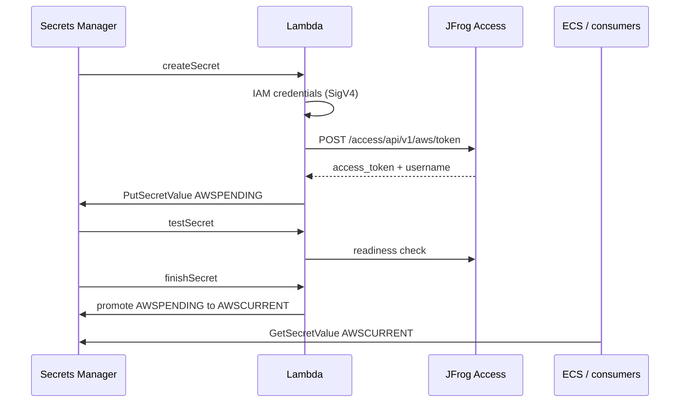

# JFrog Token Rotator Lambda for AWS Secrets Manager

## Use case

Maintain a JFrog access token in
[AWS Secrets Manager](https://aws.amazon.com/secrets-manager/) with automatic
rotation, so [AWS ECS](https://aws.amazon.com/ecs/) (and other consumers) can
pull private registry images using short-lived tokens - without storing
long-lived JFrog credentials in the rotation function. Rotation is controlled by
the Lambda execution IAM role and JFrog AWS IAM role tagging.

## Solution

An [AWS Lambda](https://aws.amazon.com/lambda/) function implements the Secrets
Manager rotation contract. On each rotation, it exchanges the Lambda IAM
credentials for a JFrog access token (SigV4 to JFrog AWS token endpoint), stores
the result as `AWSPENDING`, tests it, then promotes it to `AWSCURRENT`.

The function source code is in
[`secret-rotator/lambda_function.py`](secret-rotator/lambda_function.py). It is
deployed as a **Python zip** on the managed `python3.14` runtime (AWS SDK
dependencies come from the runtime).

### Rotation steps

1. **createSecret** - Sign a request with the Lambda IAM role, exchange for a
   JFrog access token, store JSON `{"username","password"}` as `AWSPENDING`
2. **setSecret** - Skipped (not needed for JFrog)
3. **testSecret** - Call JFrog access readiness with the pending token
4. **finishSecret** - Promote `AWSPENDING` to `AWSCURRENT`

### Environment variables

| Variable | Description | Required | Example |
| --- | --- | --- | --- |
| `JFROG_HOST` | JFrog Artifactory hostname | Yes | `mycompany.jfrog.io` |
| `SECRET_TTL` | Token expiration time in seconds | Yes | `21600` |

### Limitations

This Lambda uses regional STS authentication based on the Lambda region.

## Architecture

```text
┌─────────────┐    ┌─────────────┐    ┌─────────────┐
│ createSecret│ -> │ testSecret  │ -> │finishSecret │
└─────────────┘    └─────────────┘    └─────────────┘
```



## Setup

Choose one deployment path:

- **[Manual setup (AWS CLI & REST API)](docs/manual-setup.md)** - step-by-step
  `aws` commands and JFrog IAM role tagging via curl. The first step builds the
  deployment zip with
  [`scripts/build-lambda-zip.sh`](scripts/build-lambda-zip.sh).
- **[Terraform setup](docs/terraform-setup.md)** - Infrastructure-as-Code via
  [`terraform-example/`](terraform-example/); Terraform packages
  `secret-rotator/lambda_function.py` into a zip via the `archive` provider.
  Optionally tags a JFrog user with the Lambda IAM role
  (`assign_jfrog_iam_role`, default `true`).

Both paths provision the rotation pipeline and deploy the Lambda as a Python zip
package.

## Security considerations

- The Lambda uses AWS IAM roles for authentication (no hardcoded credentials)
- Tokens are stored in AWS Secrets Manager
- API calls are signed with AWS SigV4
- Configure `SECRET_TTL` and the secret rotation schedule so the token outlives
  the rotation interval

## License

Apache-2.0
